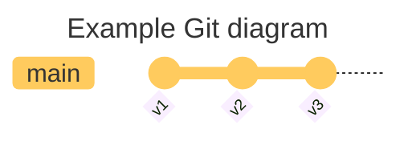
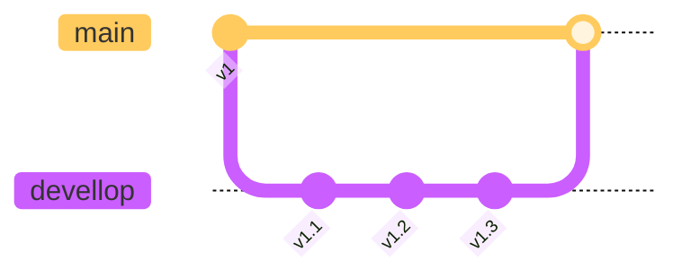

## First install docker compose and setup everything

```sh title="test.sh"
sudo apt install git
```

### Use case of git
Git est un outil permettant de gérer des projets et le versionning.


Au lieu de gérer les fichier sous forme de v1, v2 , ..., il stocke la différence et enregiste le tout sous forme de commits.


Les commits sont l'ensemble des différentes versions d'un project.


### Git branchs

In git, you can work on many different versions of your project.
It is called branchs.
Your branch is a way to separate the different parts of your project.
One is for the production branch (that can directly move on the server), on can be in a devellop state and another for features ....
```sh
git commit -m "v1"
git branch devellop
git checkout devellop
git commit -m "v1.1"
git commit -m "v1.2"
git commit -m "v1.3"
git checkout main
git merge devellop
```

Now you can see that there is only main versions in main branch.
It is a really nice way of working.

You may not find it usefull but working in team is a big fondement !TODO of programming.
In fact you may need to have a branch that is for the finale product (the main),

